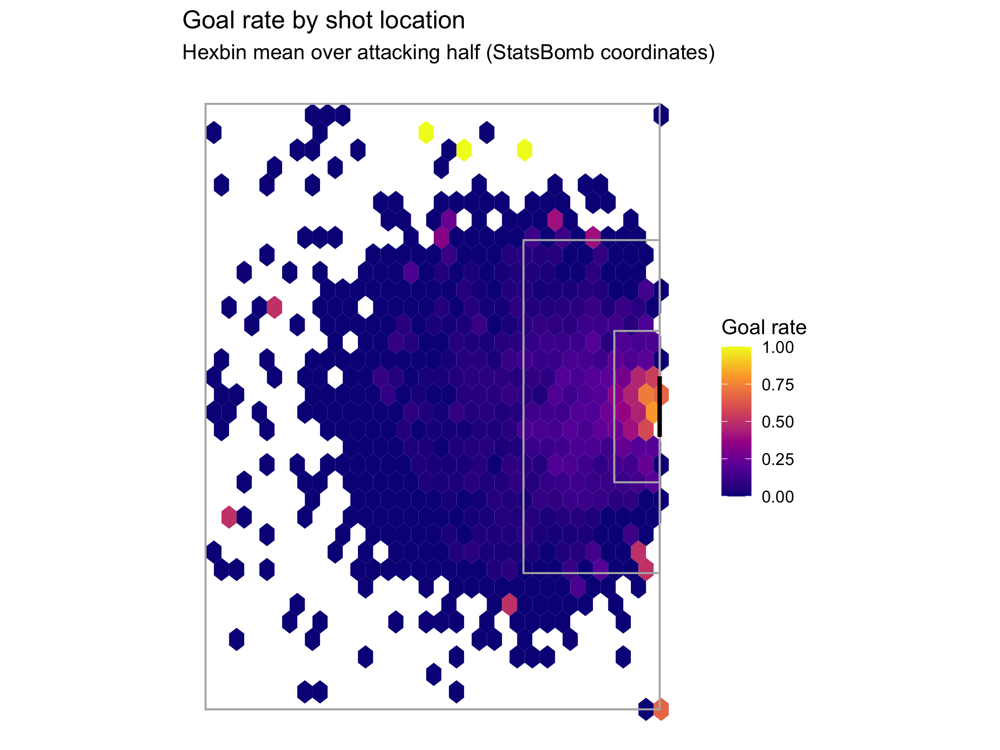
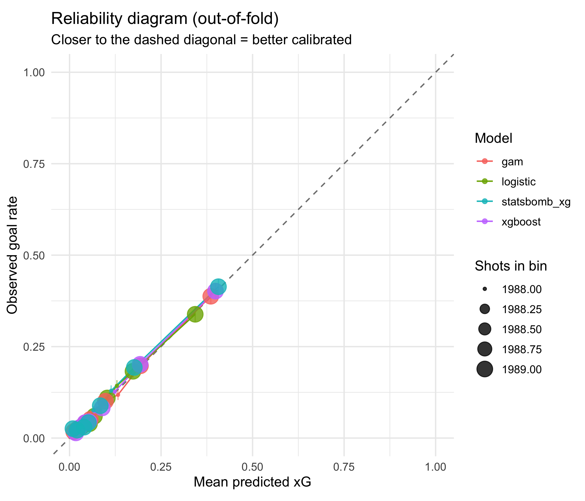
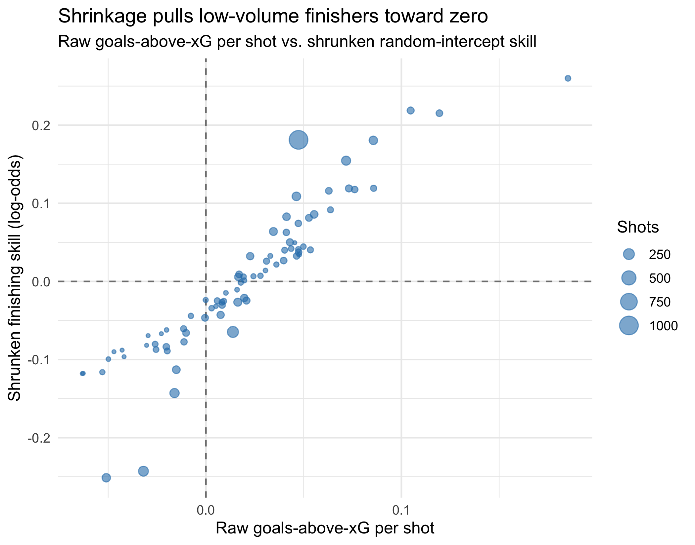

# xg-lab — Expected Goals From Scratch & the Finishing-Skill Question

Build a calibrated expected-goals (xG) model from scratch on **StatsBomb Open
Data**, benchmark it honestly against StatsBomb's own production xG, and use it
to answer a genuinely contested statistical question: **is finishing skill real
and persistent, or do players who beat their xG mostly regress to the mean?**

xG is structurally identical to click/conversion prediction in tech: a rare
binary outcome, heavy class imbalance, and a hard requirement that predicted
probabilities be **calibrated**, not merely well-ranked.

> **Status:** builds and runs end-to-end on a fresh machine in one command
> (`Rscript run_all.R`) after the data pull. Geometry + calibration helpers are
> unit-tested (`tests/test_utils.R`, hand-computed expected values).

## Headline results

Built on **19,887 shots** (2,085 goals, base rate **0.105**) from **800 matches**
across 6 competitions (StatsBomb Open Data). Penalties excluded.

**Calibration benchmark vs StatsBomb's production xG** (out-of-fold, match-grouped CV):

| Model | Log loss | Brier | ECE |
|---|---:|---:|---:|
| StatsBomb xG (benchmark) | 0.2735 | 0.0777 | 0.0065 |
| **xgboost (ours)** | **0.2758** | 0.0789 | **0.0032** |
| GAM (mgcv `s(x,y)`) | 0.2832 | 0.0801 | 0.0029 |
| logistic baseline | 0.2940 | 0.0840 | 0.0067 |

Our best model lands **within 0.0023 log loss of StatsBomb's production xG** using
only open features — and is *better calibrated* by ECE. Model ordering is the
expected xgboost ≤ GAM ≤ logistic. (We are benchmarking against a black box, not
claiming to beat it.)

**Finishing skill — real or regression to the mean?** Among **79 players with ≥40
shots**, the split-half persistence correlation of goals-above-xG is **r = 0.213
(permutation p = 0.055)**. Verdict: finishing over-performance is *mostly* noise
that the shrinkage model pulls toward zero, with at most a small persistent
signal that does not clearly clear significance in this sample — exactly the
skill-vs-luck story the project sets out to test honestly.

📄 Full technical write-up: [`analysis/report.html`](analysis/report.html)
(open the rendered HTML, or re-render with `quarto render analysis/report.qmd`).

### Three figures that tell the story

Goal rate by shot location — the visual hook:



Reliability diagram (out-of-fold): our xgboost sits on the diagonal, alongside
StatsBomb's xG.



Shrinkage pulls low-volume "great finishers" back toward zero:




## What's here

| Component | What it demonstrates |
|---|---|
| Match-grouped CV | leakage-safe evaluation for grouped/temporal data |
| Reliability + ECE + Brier decomposition | calibration rigor, not just AUC |
| Benchmark vs `shot_statsbomb_xg` | evaluating against a production system you can't inspect |
| GAM spatial smooth vs xgboost | interpretability ↔ performance trade-off |
| Hierarchical shrinkage leaderboard | ranking entities with wildly different sample sizes |
| Split-half persistence test | telling skill from luck in a metric |

## Pipeline

```
R/00_ingest.R   StatsBomb raw-JSON pull -> shots cache (configurable subset)
R/01_features.R geometry (distance, angle) + freeze-frame features
R/02_eda.R      shot-map hexbin, goal-rate curves, class balance
R/03_models.R   logistic / GAM / xgboost on identical match-grouped CV folds
R/04_calibration.R reliability diagram, ECE, Brier decomposition, SB benchmark,
                isotonic recalibration
R/05_finishing_skill.R glmer shrinkage + split-half persistence test
R/utils.R       pure geometry + scoring helpers (unit-tested)
```

## Reproduce (3 commands)

```bash
# 1. install R deps (mgcv ships with R)
Rscript -e 'install.packages(c("jsonlite","dplyr","tidyr","purrr","tibble","ggplot2","lme4","xgboost","here","testthat"))'

# 2. run the whole pipeline (pulls data, trains, calibrates, analyses)
Rscript run_all.R                 # XG_MAX_MATCHES=300 for a faster/smaller pull

# 3. render the technical report
quarto render analysis/report.qmd
```

Tunable via env vars: `XG_COMPETITIONS` (comma-sep names), `XG_MAX_MATCHES`
(download cap), `XG_MIN_SHOTS` (finishing-skill threshold), `XG_FORCE_INGEST=1`.

## Notes on scope & honesty

- **Models that transfer:** the calibration story (reliability/ECE/Brier) and
  the shrinkage/persistence reasoning are the transferable skills; soccer is the
  substrate.
- **Benchmark framing:** the goal is "how close can open features get to a
  production model," not "I beat StatsBomb." The gap is reported, not hidden.
- **Deviations from the spec, documented:** caching uses `.rds` (not parquet) to
  avoid the `arrow` C++ build; the pipeline is a lightweight sourced driver
  (`run_all.R`) rather than `{targets}`, to keep the fresh-machine dependency
  footprint small. Phase boundaries and caching are preserved.
- **Data subset:** by default a curated, capped set of competitions is pulled so
  the build is tractable; raise `XG_MAX_MATCHES` for the full pull. Exact counts
  are computed in code and shown in the report — never assumed.

## Data license & attribution

Data provided by **StatsBomb** via their
[Open Data](https://github.com/statsbomb/open-data) repository, free for
**non-commercial use**. This project is a non-commercial portfolio/skills
exercise. The `data/` directory is gitignored.